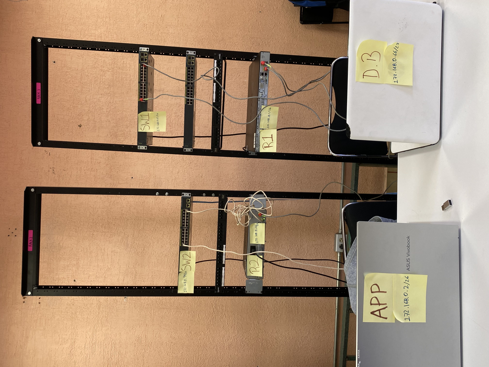

Tenemos nuetsra topología logica creada en packet traicer indicando cada ip que le corresponde a cada router y cada swich,
mostrando asi que a la PC1 le corresponde la ip 172.168.0.2/26 conectado al FastEthernet0 hacia el Swich1 a la FastEthernet0/1 
con la ip 172.168.0.62/26 hacia el Router1 al Gig0/1 con la ip 172.168.0.1, posteriormente se hace la conexión de router a router 
de la Gig0/0 que le corresponde la ip 10.0.0.5/30 hacia el Router2 en la Gig0/0 con la ip 10.0.0.6/30, para despues conectarse hacia 
el Swich2 por la Gig0/1 con la ip 172.168.0.65/27 por la FastEthernet24 al Swich2 con la ip 172.168.0.94/27, conectandose de la 
FastEthernet0/1 a la FastEthernet0 a la PC2 con la ip 172.168.0.66.

Se muestra la tabla con las interfaces de cada Router y de cada Swich con sus respectivas direcciones IP, y su mascara correspondiente.
